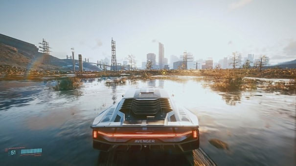

# Pesquisa-Conceitos-de-Imagem
O Repositório aborda conceitos fundamentais de imagens digitais, com foco em design de jogos. Explora pixel, raster e vetor, essenciais para qualidade visual e eficiência de processamento.

<h1 align="left"> Definição</h1>

 A Imagem de forma mais explícita, é uma representação visual de um objeto através de técnicas da fotografia, vídeo, jogo etc. Hoje em dia possuí uma grande importância em várias áreas, sendo em filmes, fotografia, documentários dentre vários outros.
Porém falando sobre a área de Game Design, podemos ver uma grande prepotência de tal, e hoje em dia podemos ver o quão realista estão ficando, possuindo uma definição gráfica imensurável.
E essa definição é em prática a qualidade visual desse game (Pode classificar em filmes e outras áreas também), influenciando tanto na nitidez, clareza e detalhes gráficos. E o interessante é que quanto maior a resolução gráfica desse jogo, maior vão ser a quantidade de pixels! Que são o maiores agentes na consequência da qualidade de uma imagem.

Nota a declarar: Jogos com resoluções grandes precisam de máquinas fortes, então claramente não vai ser todo computador que vai conseguir obstruir de tal qualidade.

<h4>Imagem do Jogo: Cyberpunk 2077</h4>

<h2>Pixel</h2>

Tão conhecido Pixels, ou “Picture Element” (Elemento de imagem), nós temos o tão importantes agentes que estão em nossas telas, tanto celular, monitor, televisão etc. Eles são uma unidade básica de cor programável (A menor unidade de uma imagem digital). 
São eles que compõem a imagem, que pode possuir milhares e milhares deles. Cada pixel é baseado com as três cores básicas do padrão RBG, sendo: Vermelho, Verde e Azul. Eles complementam a tela, e quanto mais pixels estiverem na sua tela maior vai ser a nitidez também imagens bem definidas. 
Um exemplo, com as telas Full HD que você tem em sua TV, ela possui o total de 1.920 x 1.080. Com um ponto interessante, que caso você se aproxime de sua televisão, ou use uma câmera de celular bem próximo dela, você vai conseguir enxergar alguns quadradinhos, bem pequeninos, que são os pixels da sua tela.
O tamanho em si deles é bem variado, que é um dos motivos atuais que existem monitores de tamanhos iguais porem que tem uma quantidade de pixel extravagantemente diferente. Um monitor que aguenta uma imagem em 4k possuí pixels 4 vezes menor que uma full HD e assim adiante. E com essa diminuição do tamanho do pixel ajuda para colocar mais e mais pixels, obtendo mais precisão no controle de cor etc.
OBS: “Monitores LCD convencionais trabalham com uma profundidade de 8 bits, que da uma variedade de cores muito maior que a quantidade tradicional “(Site tecnoblog).
Já na questão dos megapixels, diz a respeito da capacidade de captura de pixels em uma foto

<h4>Imagem do site InfoEscola</h4>

<h2>Raster</h2>

Imagens Raster, imagens matriciais ou bitmap são de uma forma bem simples e a grosso modo, uma matriz de uma imagem que contêm a descrição de cada pixel ou pontos de cor, com forma sequencial ou continua.
Em geral, um conjunto de Pixels são oque entregam par nós uma imagem Raster. Com um exemplo, se pegarmos uma câmera e tirarmos uma foto dela, os Pixels dentro dela serão multiplicados pela horizontal (x) por todos do eixo vertical (y), oque é a nossa imagem matricial.
Porém também possuímos a Resolução Espacial, que é o tamanho do pixel, e com uma imagem tirada de um sensor espacial, que possui uma Resolução Espacial de 30 metros, significa que cada quadradinho vai ter 30 metros de altura por 30 de largura.
E um arquivo Raster é basicamente uma fotografia gigante que ocupa grande espaço e processamento 

<h4>Imagem do site ArcMap </h4>

<h2>Vetor</h2>

Uma alternativa criada para o Raster, que são normalmente imagens constituídas por pontos, linhas, curvas e formas preenchidas. E é notável que as imagens em vetor podem ser redimensionadas (Que é quando uma imagem altera o seu tamanho) sem que percam sua qualidade, oque a difere da imagem Raster.
Os vetores são basicamente desenhos feitos em cima de uma imagem matricial. Elas sofisticam a imagem, 
Como exemplo, se você quiser ver uma imagem de um lago, se estiver usando um Raster, uma hora a imagem vai ficar pixelada, porém com uma imagem vetorial você consegue enxergar de uma forma mais nítida.
Sem contar que uma imagem vetorial é extremamente mais leve para processamento, oque faz com que arquivos vetoriais sejam mais interessante em algumas áreas.

<h4>Imagem Futura Express</h4>

